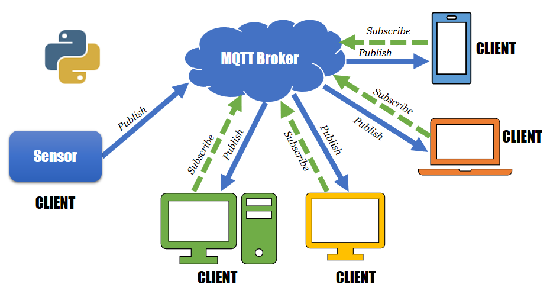

# 📶 Message Queueing Telemetry Transport

## 👀 Hızlıca Bakış

* 🕊️ Hafif cihazlar arasında publish - subscribe yapısı ile mesaj iletir
* 🍎 Mesajlar hangi abonelerin alacağı bilinmeden sınıflandırılır, konuya abone olan istemciler o konudaki mesajları alırlar
* 🙄 İstemciler birbirinin IP adresinden habersizdirler
* 👪 Birden fazla istemci tek bir yayıncıdan mesaj alabilir, birden fazla yayıncı tek istemciye mesaj verebilir
* 🕸️ Ağ bant genişliğini sınırlı olduğu uzak konumlu bağlantılar için tasarlanmıştır
* 🔗 M2M yani makineden makineye bağlantı protokolüdür
* ⛓ IoT yani Internet of Things \(nesnelerin interneti\) bağlantılarında sıklıkla kullanılır
* 🧰 Sensör gruplarını veya insansız hava araçlarını yönetmek için ideal bir protokoldür

## 💖 Avantajları Nedir?

* 🕊️ Hafif bir yapıda olduğundan IoT, Sensör ve ufak makinelerde tercih edilir
* 📦 Paketler konuya göre yönlendirildiğinden, istemcilere sadece konulara abone olurlar, bu sayede sadece istenen veriler aktarılır
* 🚩 Uzun mesafeli veri aktarımlarında efektiftir

## ⚙️ Nasıl Çalışır?

* Nem sensörü ile bilgi toplayan bir cihazımız olsun
* Bilgilerin konusu: `Türkiye/Trabzon/Orta Hisar/KTÜ/Kabin1/ Nem-Sıcaklık/Nem` şeklinde olsun
* Cihaz, verilen konu ile nem bilgisini içeren mesajı MQTT broker birimine gönderir
* Konuya kayıtlı olan abonelere mesajlar iletilir
* Alt konulara kayıt olma işlemi: `Türkiye/Trabzon/Orta Hisar/KTÜ/Kabin1/#` ile Kabin1 altındaki tüm konulara abone olunur
* Belirli düzeydeki konulara kayıt olma: `Türkiye/Trabzon/Orta Hisar/KTÜ/+/ Nem-Sıcaklık/Nem` ile tüm kabinlere abone olunur
* Cihaz her veri ürettiğinde bağlı aracıya verileri içeren bir 2B - 256MB boyutu arasında kontrol mesajı gönderir

> 💁‍♂️ Konuların `/` karakteri ile ayrılması mühim değildir, dosya sistemi ayıracı olduğundan genelde tercih edilebilir

## ⭐ Nerelerde Kullanılır?

* ✈️ İnsansız hava araçları
* 🧰 AWS \(Amazon Web Services\)
* 🏠 Akıllı Şehir Kontrol Sistemleri
* ⛽ Petrol ve Gaz Endüstrisi
* 🗨️ Facebook Messenger

## 🔗 Faydalı Bağlantılar

* [📃 MQTT \(Message Queuing Telemetry Transport — Mesaj Kuyruğu Telemetri Aktarımı\) Protokolü](https://medium.com/@selimyalnkaya/message-queuing-telemetry-transport-mqtt-mesaj-kuyru%C4%9Fu-telemetri-aktar%C4%B1m%C4%B1-protokol%C3%BC-1e66ebdd9fbb)
* [📃 MQTT Protokolünü Python ile Uygulanması](https://medium.com/@selimyalnkaya/mqtt-protokol%C3%BCn%C3%BC-python-ile-uygulanmas%C4%B1-13cdd31e1c90)

