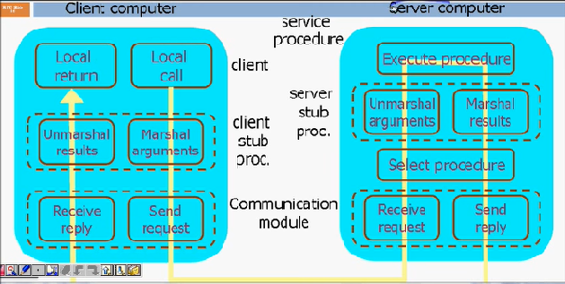

# 🔌 Remote Procedure Call

## 👀 Hızlıca Bakış

* 🔌 Sunucu ve istemci arasında çalışan programlar için kullanılır
* 💁‍♂️ Mail server gibi hem sunucu hem de istemci üzerinden mail gönderme işlemleri için tercih edilir

## 💖 Avantajları Nelerdir?

* 👨‍💻 İstemcilerin sunucu ile geleneksel sistem çağrıları ve prosedürler ile yüksek seviyeli programlama dilleri ile iletişimde bulunmasına fayda sağlar
* 💎 Hem dağıtık hem de yerel sistemlerde kullanılabilir bir yapıdır
* 🤝 Process veya thread odaklı modelleri destekler
* 🌃 Dahili mesaj aktarımı işlemlerini kullanıcıdan gizli olarak yapar \(_abstraction_\)
* 📈 Diğer protoköl katmanlarını çıkardığından performansı artırır

## ⚙️ Nasıl Çalışır?

* İstemci, parametrelerin yığına aktarıldı yerel bir istek olan **client stub** isteğinde bulunur
* **Client stub** parametreleri mesaj paketine çevirip \(**marshalling**\), mesajı göndermek için sistem çağrısında bulunur
* İstemci üzerindeki işletim sistemi uzak sunucuya mesajları gönderir
* Sunucu işletim sistemi gelen mesajları alır ve Server Stub alanına aktarır
* Gelen mesajlar server stub üzerinde parametrelerine ayrıştırılır \(**unmarshalling**\)
* İşlemler tamamlandıktan sonra, server stub üzerinde yanıt parametreleri içeren mesajlar oluşturulur \(**marshalling**\) ve server stub tarafından bu mesajlar transport layer alanına aktarılır
* Sunucu transport layer alanı mesajları client stub üzerine aktarmak amacıyla istemcinin transport layer alanına aktarır
* Client stub mesajlardan parametreleri ayrıştırır ve uygular, sonuçları istekte bulunan sunucuya gönderir

> 💡 RPC Stub, client veya istemci tarafından RPC isteğini başlatmak için yapılan aktivitedir

## 🍱 Kullanılan Bileşenler

* İstemci veya sunucu işlemcisi
* RPC stubs
* Marshalling engine \(parametreleri mesajlardan ayrıştırmak için NDR20 veya NDR64\)
* Runtime API \(bilgisayarı kontrol etmek için\)
* RPC protokolü ile bağlantı yapacak araç
* RPC protokollerini yerel olarak işleyecek araç
* Registry \(kayıt defteri\)
* Win32 APIs \(sistem çağrıları yapmak için: kernel32.dll, advapi32.dll, ntdll.dll\) 
* SSPI \(güvenlik için secur32.dll\) 

> 🤝 RPC; TCP, SPX, HTTP, UDP ve CDP gibi protokolleri destekler

## 🔗 Faydalı Bağlantılar

* [📚 Uzaktan Yardım Çağrısı](https://tr.wikipedia.org/wiki/Uzaktan_yordam_%C3%A7a%C4%9Fr%C4%B1s%C4%B1)
* [📃 RPC nedir?](https://www.nedir.com/rpc)
* [📃 What is Remote Procedure Cal \(RPC\)?](https://searchapparchitecture.techtarget.com/definition/Remote-Procedure-Call-RPC)
* [📃 Remote Procedure Call Nedir?](https://www.hakanuzuner.com/rpc-remote-procedure-call-nedir/)

