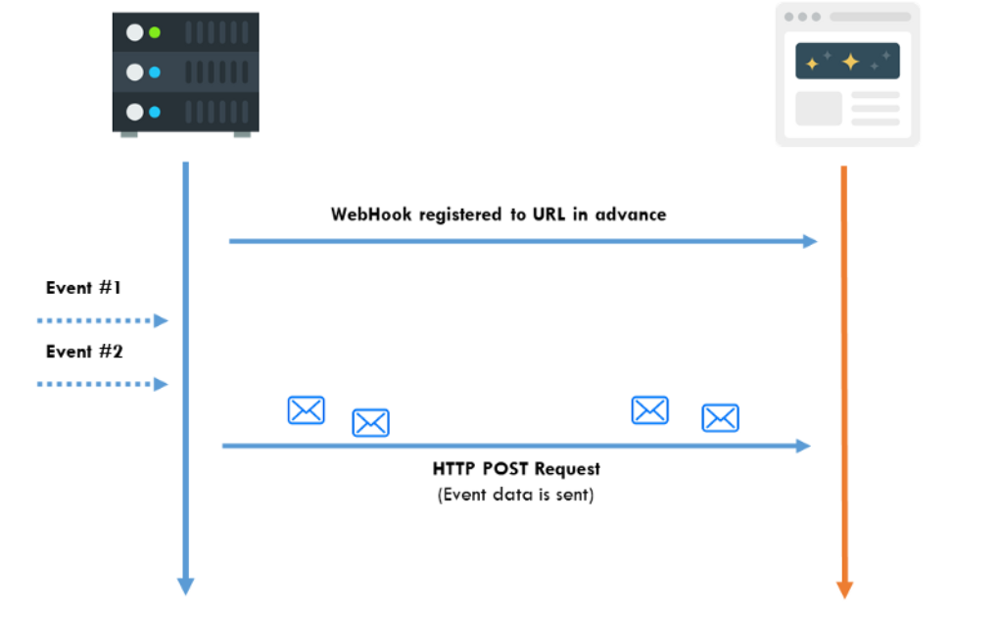

# ⚓ Webhooks

## 👀 Hızlıca Bakış

* 👀 Her veri değiştiğinde çalışması gereken işlemler için tercih edilir
* 💻 Haberleşme işlemleri genellikle server üzerinde olur
* 🐥 Genellikle durum değişikliklerinde tetiklenirler

## 💖 Avantajları

* 📈 Değişiklik takibi için tekrarlı istek atmak yerine, değişiklik olduğunda işlemler yapıldığından sunucu maliyetini düşürür
* 🤵 Sunucu endpoint değerine çok fazla istek olmayacağından daha verimli bir kullanıcı deneyimi sağlar

## 💔 Dezavantajları

* 😪 Geliştiriciler webhook işlemlerini kurmakta ve HTTP servislerine uyarlamakta zorlanırlar

## ⚙️ Nasıl Çalışır?

* Gönderici üzerindeki URL üzerine callback eylemi atanır
* URL üzerinde herhangi bir değişiklik olduğunda gönderici üzerindeki callback tetiklenir
* Tetiklenme sonucunda HTTP post isteği ile her bir alıcıya mesaj gönderilir

## ⭐ Nerelerde Kullanılır?

* 🔔 Bildirimler gibi duruma bağlı tetiklenen eylemlerde

## 🔗 Faydalı Bağlantılar

* [📃 HTTP and Websockets: Understanding the capabilities of today’s web communication technologies](https://medium.com/platform-engineer/web-api-design-35df8167460)

